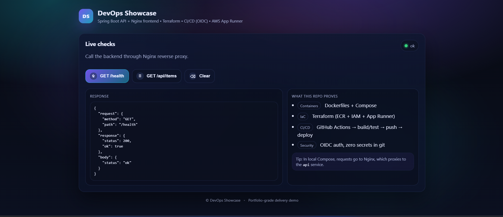
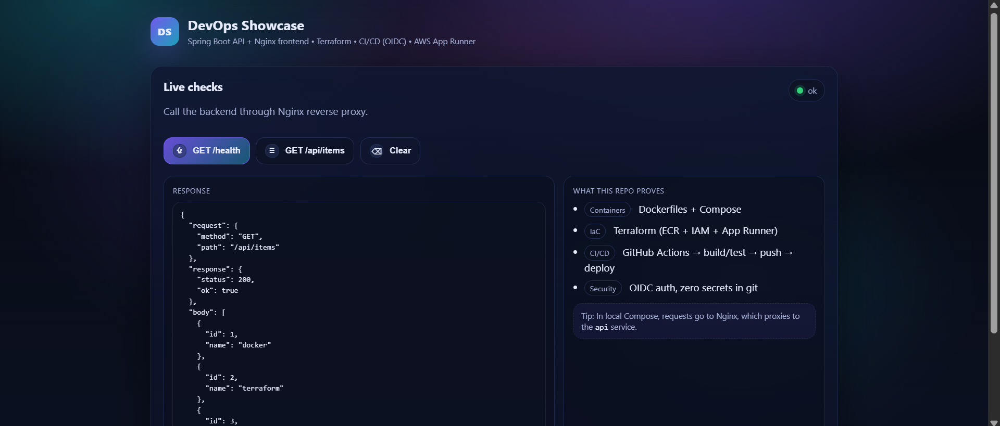

# DevOps Showcase (AWS App Runner + ECR + Terraform + GitHub Actions OIDC)

A minimal but production-minded delivery demo:
- **Backend**: Spring Boot API (health + sample endpoints + tests)
- **Frontend**: static Nginx container (calls the API)
- **Local**: Docker Compose (front + api)
- **Cloud**: AWS **ECR** + **App Runner**
- **IaC**: Terraform
- **CI/CD**: GitHub Actions using **OIDC** (no long-lived AWS keys)

## Screenshots

  


---

## Architecture

- GitHub Actions builds & tests the API
- Docker images are built and pushed to **private ECR**
- **App Runner** pulls images from ECR using an **ECR access role**
- Frontend calls the API over HTTPS (CORS allowed for the front domain)

```
Developer → push main
   ↓
GitHub Actions (OIDC → AWS)
   ├─ mvnw test
   ├─ build/push API image → ECR
   ├─ build/push FRONT image → ECR (inject API_URL at build time)
   └─ wait + trigger App Runner deployments
        ↓
AWS App Runner (front)  → calls → AWS App Runner (api)
```

---

## Repo structure

```
backend/                 Spring Boot API + tests + Dockerfile
frontend/                Static site + Nginx + Dockerfile
infra/
  docker-compose.dev.yml Local dev compose
  terraform/             Terraform IaC (ECR, IAM, App Runner)
.github/workflows/ci.yml GitHub Actions CI/CD
```

---

## Prerequisites

Local:
- Docker + Docker Compose
- Java 21 (optional if you run via Docker only)

Cloud:
- AWS account (billing enabled)
- Terraform >= 1.6
- A GitHub repo with Actions enabled

---

## Local run (Docker Compose)

```bash
cp .env.example .env
docker compose -f infra/docker-compose.dev.yml up -d --build
```

Open:
- Front: http://localhost:8081
- API (direct): http://localhost:8080/health

Stop:
```bash
docker compose -f infra/docker-compose.dev.yml down -v
```

---

## Cloud deploy (Terraform)

> Terraform state is local by default in this repo. Do **not** commit tfstate.

### 1) Configure AWS credentials locally (for Terraform)
Use AWS CLI with an IAM user or SSO locally. (CI uses OIDC.)

Verify:
```bash
aws sts get-caller-identity
```

### 2) Set the GitHub repo for OIDC (local-only)
Create `infra/terraform/terraform.tfvars` (this file is gitignored):
```hcl
github_repo = "ZMehdiDev/DevOps_Showcase"
```

### 3) Apply
```bash
cd infra/terraform
terraform init
terraform apply
```

Terraform outputs:
- `apprunner_service_url` (API)
- `apprunner_front_url` (Frontend)
- ECR repository URLs
- IAM role ARNs

---

## CI/CD (GitHub Actions + OIDC)

On every push to `main`:
- runs `./mvnw test`
- builds and pushes:
  - `devops-showcase-api:latest` + `sha-<commit>`
  - `devops-showcase-front:latest` + `sha-<commit>`
- waits for services to be `RUNNING`, then triggers App Runner deployments for API + Front

✅ No long-lived AWS keys in GitHub secrets (OIDC only).

---

## Security notes (portfolio-grade)

- **No secrets committed**
  - `.env` is ignored; only `.env.example` is tracked
  - Terraform state files are ignored
- CI authentication uses **AWS OIDC** (`id-token: write`)
- App Runner pulls from private ECR via an **ECR access role**
- CORS is restricted to the frontend App Runner domain (no wildcard)

---

## Troubleshooting

### App Runner service stuck / CREATE_FAILED
- Check App Runner logs in AWS console
- Ensure `latest` tag exists in ECR
- Redeploy: `aws apprunner start-deployment --service-arn <ARN>`

### CORS error from frontend
- Verify API returns CORS headers:
```bash
curl -i -H "Origin: https://<front-domain>" https://<api-domain>/health
```

### Terraform destroy fails with `OPERATION_IN_PROGRESS`
- Wait until the service is not deploying, then rerun `terraform destroy`.

---

## Teardown (clean destroy)

```bash
cd infra/terraform
terraform destroy
```

---

## Cost control

- Create an AWS Budget + alerts.
- Always run `terraform destroy` when finished testing.
